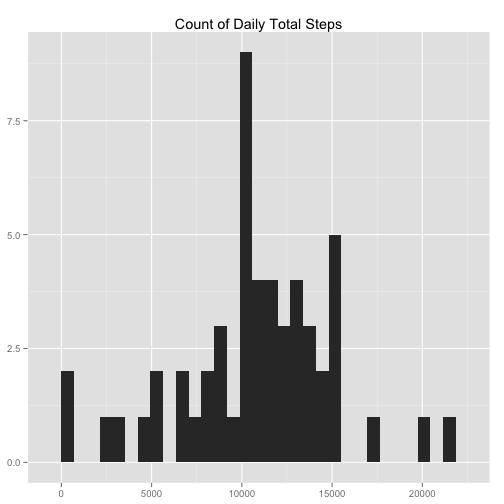
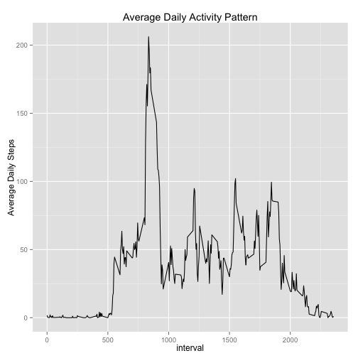
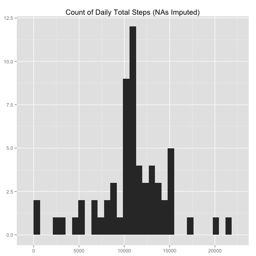
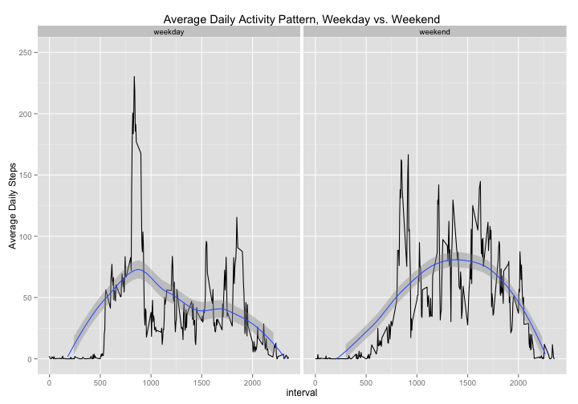

#Title
That was the title.


Notes:
Created using R version 3.1.2
Ensure working directory is set to folder containing (unzipped) activity data

##Loading and Preprocessing the data
Code below loads data (and required packages for the ensuing analysis):

```r
activity_data <- read.csv("activity.csv")
library(plyr)
library(dplyr)
library(ggplot2)
library(lubridate)
```
Additional Notes:
* Created using R version 3.1.2
* Ensure working directory is set to folder containing (unzipped) activity data

##What is the mean total number of steps taken per day?

Plot of total number of steps by day:

```r
steps_day <- ddply(activity_data, .(date), summarize, total_steps = sum(steps))
qplot(steps_day$total_steps, geom = "histogram", main = "Count of Daily Total Steps", xlab = NULL, ylab = NULL)
```

```
## stat_bin: binwidth defaulted to range/30. Use 'binwidth = x' to adjust this.
```



Mean and median total number of steps taken per day (excluding NA values):

```r
mean(steps_day$total_steps, na.rm=TRUE)
```

```
## [1] 10766.19
```

```r
median(steps_day$total_steps, na.rm=TRUE)
```

```
## [1] 10765
```

##What is the average daily activity pattern?

Plot of average number of steps by interval (after using ddply() to calculate the mean number of steps for each interval across all days):


```r
interval_steps <- ddply(activity_data, .(interval), summarize, avg_interval_steps = mean(steps, na.rm = TRUE))
qplot(x = interval, y = avg_interval_steps, data = interval_steps,  geom = "line", main = "Average Daily Activity Pattern", ylab = "Average Daily Steps")
```



Return 5-minute interval that contains the maximum number of steps, on average across all days of the dataset:


```r
interval_steps[which.max(interval_steps$avg_interval_steps), 1]
```

```
## [1] 835
```

This interval would correspond to a time slightly before 2 p.m.

##Imputing misssing values

1. Calculate and report the total number of missing values in the dataset (i.e. the total number of rows with NAs):


```r
sum(is.na(activity_data))
```

```
## [1] 2304
```

Note: All NA values are for the "steps" variable--no other variables contain NA observations. This is verified below by counting only NA observations in the "steps" variable:

```r
sum(is.na(activity_data$steps))
```

```
## [1] 2304
```

2. Devise a strategy for filling in all of the missing values in the dataset.

I will replace missing values by imputing the average value for that interval across all days of the dataset (calculated above, stored as interval_steps). For example, if interval 220 is missing its value, it will be replaced with the average value for interval 220 across all days for which the number of steps was recorded in that interval.

3. Create a new dataset that is equal to the original dataset but with the missing data filled in.


```r
##create new dataset activity_data_NA_rm, copy of original dataset:

activity_data_NA_rm <- activity_data

##impute missing values using method described above:
for (i in 1:17568) {
	if (is.na(activity_data_NA_rm[i, 1]) == TRUE) {
		missing_interval <- activity_data_NA_rm[i, 3]
		avg_int_steps <- filter(interval_steps, interval == missing_interval)$avg_interval_steps
		activity_data_NA_rm[i, 1] <- avg_int_steps

	}
}
```

4. Make a histogram of the total number of steps taken each day and Calculate and report the mean and median total number of steps taken per day.


```r
steps_day_2 <- ddply(activity_data_NA_rm, .(date), summarize, total_steps = sum(steps))
qplot(steps_day_2$total_steps, geom = "histogram", main = "Count of Daily Total Steps (NAs Imputed)", xlab = NULL, ylab = NULL)
```

```
## stat_bin: binwidth defaulted to range/30. Use 'binwidth = x' to adjust this.
```



```r
mean(steps_day_2$total_steps)
```

```
## [1] 10766.19
```

```r
median(steps_day_2$total_steps)
```

```
## [1] 10766.19
```

Do these values differ from the estimates from the first part of the assignment? What is the impact of imputing missing data on the estimates of the total daily number of steps?

* The value for the mean does not differ from the estimate from the first part of the assignment. This is to be expected: because the number of steps was simply replaced with the mean for each interval, the center of the data was not shifted (more data accumulated at this center instead).
* The value for the median decreases slightly, likely because many of the imputed data values were below the original median for the overall dataset. In addition, imputing the missing values changes the number of observed observations, potentially shifting the median (which is simply the middle value of all observed values) in the direction of the newly non-missing values in the dataset.

##Are there differences in activity patterns between weekdays and weekends?

1. Create a new factor variable in the dataset with two levels – “weekday” and “weekend” indicating whether a given date is a weekday or weekend day.

```r
newdate <- strptime(activity_data_NA_rm$date, format = "%Y-%m-%d")
activity_data_NA_rm <- cbind(activity_data_NA_rm, newdate)
activity_data_NA_rm <- mutate(activity_data_NA_rm, weekday = wday(newdate))
##note: this creates a column 'weekday' of class numeric, based on day of week, where 1 = Sunday, 2 = Monday, etc.

activity_data_NA_rm$weekend_factor <- ifelse(activity_data_NA_rm$weekday >1 & activity_data_NA_rm$weekday < 7, "weekday", "weekend")
interval_steps_week_weekend <- ddply(activity_data_NA_rm, .(interval, weekend_factor), summarize, avg_interval_steps = mean(steps))
```

2. Make a panel plot containing a time series plot (i.e. type = "l") of the 5-minute interval (x-axis) and the average number of steps taken, averaged across all weekday days or weekend days (y-axis).

```r
qplot(x = interval, y = avg_interval_steps, data = interval_steps_week_weekend, facets = . ~ weekend_factor, geom = c("line", "smooth"), ylim = c(0, 250), main = "Average Daily Activity Pattern, Weekday vs. Weekend", ylab = "Average Daily Steps")
```

```
## geom_smooth: method="auto" and size of largest group is <1000, so using loess. Use 'method = x' to change the smoothing method.
## geom_smooth: method="auto" and size of largest group is <1000, so using loess. Use 'method = x' to change the smoothing method.
```

```
## Warning: Removed 7 rows containing missing values (geom_path).
```

```
## Warning: Removed 10 rows containing missing values (geom_path).
```



* Note: smoothing lines were included in the above plot to highlight differences in the overall shape of the datasets. Plots generated side-by-side, instead of stacked as shown in example plot, to allow easier comparison between y-values (number of steps in interval), because overall trends across times of day (x-values) were made more visible by these smoothing lines.

In general, there do appear to be some significant differences between average activity patterns on weekdays compared to weekends: 

* On weekdays, the user typically shows a large increase in their activity after approximately interval 500 (which would be roughly 8:30 a.m.). After this, steps per interval plateaus at slightly above 50, again rising sharply between intervals 750 and 900 (which would correspond to 12:30 and 3 p.m.; presumably, this is lunch time or some other type of break or change in work pattern). 
* In contrast, on weekends, the user typically shows very little activity until after interval 750 (again, 12:30 p.m.)--presumably the user is sleeping in or relaxing--with more sustained activity in the afternoon, and with more and higher peaks, than shown on weekdays during the afternoon. Both weekdays and weekends show a general decreasing trend in the evenings, showing a near-cessation of all activity roughly at interval 2250.
